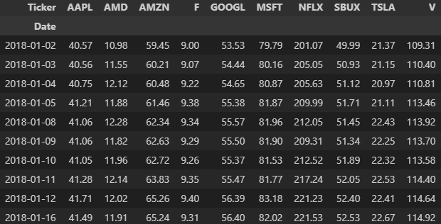
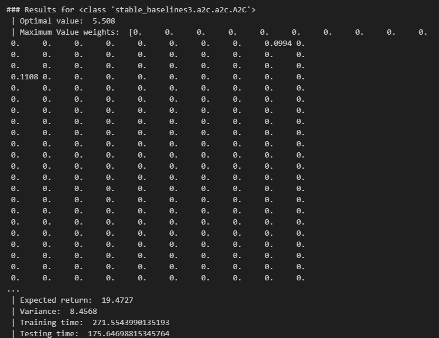

# Subset Selection Problem

## Python packages

```bash
pip install -r ./requirements.txt
```

gurobipy>=11.0.2

gymnasium>=0.29.1

matplotlib>=3.9.1

numpy<=1.26.0

openpyxl>=3.1.5

pandas>=2.2.2

scikit-learn>=1.5.2

scipy>=1.14.0

stable_baselines3>=2.3.2

torch>=2.3.1

numpy version can't be higher than 2.0.


## How to use

SSP-MV-Vect.ipynb should be the only file that can be modified. You can change the dictionaries. When keys are not provided or have incorrect types, you will receive a log message, for instance "Key policy not in dict."

The message "Could not render content for 'application/vnd.jupyter.widget-view+json'{"model_id":"7303795a1f0c472a951d906b978b2f38","version_major":2,"version_minor":0}" might appear but is simply a loading / saving error and will not affect the functionality.


## Files & Folders

* SSP-MV-Vect.ipynb: Main Notebook where the parameters can be choosen and where users can run the models. The dataset used are *indtrack7.txt* and *indtrack8.txt.*
* SSP_with_other_data.ipynb: Alternative Notebook with another dataset.
* Gurobi_SSP.ipynb: Notebook used to compute Gurobi's solutions.
* plot.ipynb: Notebook used to compare the results.
* training.py: Python file for the functions used by the DRL models for training and testing.
* environment.py: Python file for the DRL environments.
* Data: Folder for the datasets used during this project. Data from yfinance package were used but not saved here.
* Images: Folder for the plots generated during training and testing. Dataset used: *indtrack7.txt*. Hyperparameters used are in the file name.
* Plots: Folder for the plots used to compare the results.
* Sheets: Folder for the .xlsx files used to store the results.

## Results explained

Here is an example, with the data of $n = 10 $ companies over $m = 10$ days.



### Goal: Find $x$ which gives the highest $\sigma \mu^T x - ( 1 - \sigma) x^T \Sigma x$

where: 

$\mu$ = Mean of each Ticker (column)
$\Sigma$ = Covariance matrix of the data

$\sigma$ = Risk trade-off

$x$ is a vector of size $n$, which represents the weight of each asset in the portfolio. Each $x_i$ corresponds to the proportion of the total investment allocated to the $i^{th}$ asset.


For Deep Reinforcement Learning models, we need sequential data, so we define $\mu_t$ and $\Sigma_t$, which represent the mean and covariance matrix respectively, computed at time $t$ using the first $t$ time steps of the data. For instance, at $t$ = 3, the model only use and see the first $3$ rows, it computes both $\mu_t$ and $\Sigma_t$ and gives the best $x$ for $t = 3$. Then, at the following time step, at $t=4$, the model only use and see the first $4$ rows, and so on.


At the end, the model shows the following plot and results:





This figure only represents the **test**, so the Expected Return and Variance at each time step $t$ **after being trained**. The printed results are more important, where we can read the Optimal value (objective function), the final Expected Return and final Variance (the last time step), which are in fact $\mu^T x$ and $x^T \Sigma x$.
